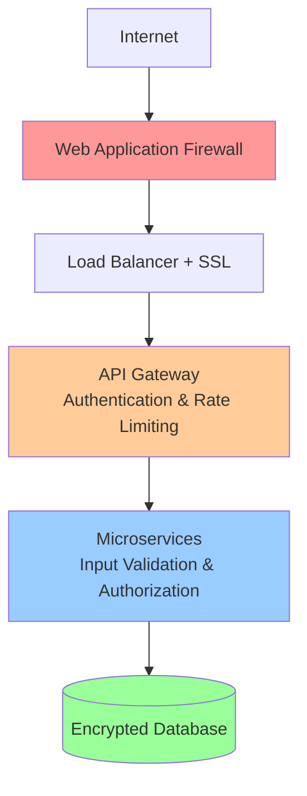

# Security Guide

This document outlines the security measures implemented in the EMS Agent and provides guidelines for maintaining a secure deployment.

## Table of Contents

1. [Security Architecture](#security-architecture)
2. [Authentication & Authorization](#authentication--authorization)
3. [API Security](#api-security)
4. [Data Protection](#data-protection)
5. [Network Security](#network-security)
6. [Container Security](#container-security)
7. [Monitoring & Incident Response](#monitoring--incident-response)
8. [Security Best Practices](#security-best-practices)
9. [Compliance & Auditing](#compliance--auditing)

## Security Architecture

### Defense in Depth

The EMS Agent implements multiple layers of security:



### Security Components

| Component | Security Feature | Implementation |
|-----------|------------------|----------------|
| **API Gateway** | Authentication, Rate Limiting, Request Validation | JWT tokens, Redis-based rate limiting |
| **Services** | Input validation, SQL injection prevention | Pydantic models, parameterized queries |
| **Database** | Encryption at rest, access controls | MongoDB encryption, role-based access |
| **Network** | TLS encryption, network segmentation | SSL/TLS certificates, Docker networks |
| **Monitoring** | Security event logging, anomaly detection | Structured logging, security alerts |

## Authentication & Authorization

### JWT Authentication

**Implementation:**

```python
# Security configuration
from fastapi import Depends, HTTPException, status
from fastapi.security import HTTPBearer, HTTPAuthorizationCredentials
from jose import JWTError, jwt
from datetime import datetime, timedelta

# JWT Configuration
JWT_SECRET_KEY = os.getenv("JWT_SECRET_KEY")
JWT_ALGORITHM = "HS256"
JWT_EXPIRATION_TIME = timedelta(hours=24)

security = HTTPBearer()

async def get_current_user(credentials: HTTPAuthorizationCredentials = Depends(security)):
    """Extract and validate JWT token"""
    try:
        payload = jwt.decode(credentials.credentials, JWT_SECRET_KEY, algorithms=[JWT_ALGORITHM])
        username: str = payload.get("sub")
        if username is None:
            raise HTTPException(
                status_code=status.HTTP_401_UNAUTHORIZED,
                detail="Invalid authentication credentials",
                headers={"WWW-Authenticate": "Bearer"},
            )
        return username
    except JWTError:
        raise HTTPException(
            status_code=status.HTTP_401_UNAUTHORIZED,
            detail="Invalid authentication credentials",
            headers={"WWW-Authenticate": "Bearer"},
        )

# Protected endpoint example
@app.get("/api/v1/data/secure")
async def secure_endpoint(current_user: str = Depends(get_current_user)):
    return {"message": f"Hello {current_user}, this is a secure endpoint"}
```

### Role-Based Access Control (RBAC)

**User Roles:**

```python
from enum import Enum

class UserRole(Enum):
    ADMIN = "admin"
    ANALYST = "analyst"
    VIEWER = "viewer"
    METER_READER = "meter_reader"

# Role permissions mapping
ROLE_PERMISSIONS = {
    UserRole.ADMIN: ["read", "write", "delete", "admin"],
    UserRole.ANALYST: ["read", "write", "analyze"],
    UserRole.VIEWER: ["read"],
    UserRole.METER_READER: ["read", "write:meter_data"]
}

def require_permission(permission: str):
    """Decorator to require specific permission"""
    def decorator(func):
        async def wrapper(*args, **kwargs):
            user = kwargs.get("current_user")
            if not user or not user.has_permission(permission):
                raise HTTPException(
                    status_code=status.HTTP_403_FORBIDDEN,
                    detail="Insufficient permissions"
                )
            return await func(*args, **kwargs)
        return wrapper
    return decorator

# Usage example
@app.delete("/api/v1/data/{meter_id}")
@require_permission("delete")
async def delete_meter_data(meter_id: str, current_user: User = Depends(get_current_user)):
    # Only users with delete permission can access this endpoint
    pass
```

### API Key Authentication

For service-to-service communication:

```python
API_KEY_HEADER = "X-API-Key"

async def validate_api_key(api_key: str = Header(..., alias=API_KEY_HEADER)):
    """Validate API key for service authentication"""
    if not api_key or not is_valid_api_key(api_key):
        raise HTTPException(
            status_code=status.HTTP_401_UNAUTHORIZED,
            detail="Invalid API key"
        )
    return api_key

def is_valid_api_key(api_key: str) -> bool:
    """Validate API key against stored keys"""
    # In production, store API keys securely hashed
    valid_keys = get_valid_api_keys()  # From secure storage
    return bcrypt.checkpw(api_key.encode(), valid_keys.get(api_key[:8]))
```

## API Security

### Rate Limiting

**Implementation using Redis:**

```python
import redis
from datetime import datetime, timedelta

class RateLimiter:
    def __init__(self, redis_client):
        self.redis = redis_client
    
    async def is_allowed(self, key: str, limit: int, window: int) -> bool:
        """Check if request is within rate limit"""
        current_time = datetime.now()
        window_start = current_time - timedelta(seconds=window)
        
        # Remove old entries
        await self.redis.zremrangebyscore(key, 0, window_start.timestamp())
        
        # Count current requests
        current_requests = await self.redis.zcard(key)
        
        if current_requests >= limit:
            return False
        
        # Add current request
        await self.redis.zadd(key, {str(current_time): current_time.timestamp()})
        await self.redis.expire(key, window)
        
        return True

# Rate limiting middleware
@app.middleware("http")
async def rate_limit_middleware(request: Request, call_next):
    client_ip = request.client.host
    api_key = request.headers.get("X-API-Key")
    
    # Different limits for different authentication levels
    if api_key:
        rate_limit_key = f"api_key:{api_key}"
        limit, window = 1000, 3600  # 1000 requests per hour for API keys
    else:
        rate_limit_key = f"ip:{client_ip}"
        limit, window = 100, 3600   # 100 requests per hour for IP
    
    rate_limiter = RateLimiter(redis_client)
    
    if not await rate_limiter.is_allowed(rate_limit_key, limit, window):
        return JSONResponse(
            status_code=429,
            content={"error": "Rate limit exceeded"}
        )
    
    response = await call_next(request)
    return response
```

### Input Validation & Sanitization

**Using Pydantic models:**

```python
from pydantic import BaseModel, validator, Field
from typing import Optional
import re

class EnergyDataInput(BaseModel):
    meter_id: str = Field(..., min_length=1, max_length=50, regex=r"^[A-Za-z0-9_-]+$")
    timestamp: datetime
    energy_consumption: float = Field(..., ge=0, le=100000)  # Reasonable bounds
    power_factor: Optional[float] = Field(None, ge=0, le=1)
    location: Optional[str] = Field(None, max_length=200)
    
    @validator('meter_id')
    def validate_meter_id(cls, v):
        """Additional validation for meter ID"""
        if not re.match(r"^[A-Za-z0-9_-]+$", v):
            raise ValueError("Meter ID can only contain alphanumeric characters, hyphens, and underscores")
        return v
    
    @validator('timestamp')
    def validate_timestamp(cls, v):
        """Ensure timestamp is not in the future"""
        if v > datetime.now():
            raise ValueError("Timestamp cannot be in the future")
        return v
    
    class Config:
        # Prevent additional fields
        extra = "forbid"
```

### SQL Injection Prevention

**Using parameterized queries:**

```python
from motor.motor_asyncio import AsyncIOMotorClient

class SecureDataAccess:
    def __init__(self, db_client):
        self.db = db_client
    
    async def get_meter_data(self, meter_id: str, start_date: datetime, end_date: datetime):
        """Secure database query with proper parameter binding"""
        
        # Validate inputs
        if not isinstance(meter_id, str) or len(meter_id) > 50:
            raise ValueError("Invalid meter_id")
        
        # Use MongoDB's built-in parameter binding
        query = {
            "meter_id": meter_id,  # Direct parameter - MongoDB handles escaping
            "timestamp": {
                "$gte": start_date,
                "$lte": end_date
            }
        }
        
        # Additional security: limit result size
        cursor = self.db.energy_data.find(query).limit(10000)
        return await cursor.to_list(length=None)
```

## Data Protection

### Encryption at Rest

**MongoDB encryption configuration:**

```yaml
# MongoDB configuration with encryption
storage:
  engine: wiredTiger
  wiredTiger:
    engineConfig:
      directoryForIndexes: true
    collectionConfig:
      blockCompressor: snappy
    indexConfig:
      prefixCompression: true
  encryptionAtRest:
    encryptionEnabled: true
    encryptionKeyFile: /path/to/encryption.key
```

### Encryption in Transit

**TLS Configuration:**

```python
# FastAPI with TLS
import ssl
import uvicorn

# SSL context for production
ssl_context = ssl.SSLContext(ssl.PROTOCOL_TLS_SERVER)
ssl_context.load_cert_chain("/path/to/cert.pem", "/path/to/key.pem")

if __name__ == "__main__":
    uvicorn.run(
        app,
        host="0.0.0.0",
        port=8000,
        ssl_context=ssl_context if not DEBUG else None
    )
```

### Data Anonymization

**PII protection for analytics:**

```python
import hashlib
from typing import Dict, Any

class DataAnonymizer:
    def __init__(self, salt: str):
        self.salt = salt
    
    def hash_pii(self, value: str) -> str:
        """Hash personally identifiable information"""
        return hashlib.sha256(f"{value}{self.salt}".encode()).hexdigest()[:16]
    
    def anonymize_record(self, record: Dict[str, Any]) -> Dict[str, Any]:
        """Anonymize sensitive fields in a data record"""
        anonymized = record.copy()
        
        # Fields that should be anonymized
        pii_fields = ["customer_id", "email", "phone", "address"]
        
        for field in pii_fields:
            if field in anonymized:
                anonymized[field] = self.hash_pii(str(anonymized[field]))
        
        return anonymized
```

### Secrets Management

**Using environment variables and secrets:**

```python
import os
from typing import Optional

class SecureConfig:
    def __init__(self):
        self.jwt_secret = self._get_secret("JWT_SECRET_KEY")
        self.db_password = self._get_secret("MONGODB_PASSWORD")
        self.api_keys = self._load_api_keys()
    
    def _get_secret(self, key: str) -> str:
        """Safely get secret from environment"""
        value = os.getenv(key)
        if not value:
            raise ValueError(f"Required secret {key} not found")
        return value
    
    def _load_api_keys(self) -> Dict[str, str]:
        """Load API keys from secure storage"""
        # In production, load from AWS Secrets Manager, HashiCorp Vault, etc.
        api_keys_file = os.getenv("API_KEYS_FILE", "/secrets/api_keys.json")
        
        if os.path.exists(api_keys_file):
            with open(api_keys_file, 'r') as f:
                return json.load(f)
        
        return {}
```

## Network Security

### Docker Network Security

**Secure Docker Compose configuration:**

```yaml
# docker-compose.yml with security
version: '3.8'

services:
  api-gateway:
    build: .
    ports:
      - "8000:8000"
    networks:
      - frontend
      - backend
    environment:
      - NETWORK_MODE=restricted
    
  data-ingestion:
    build: .
    networks:
      - backend
    # No exposed ports - only internal communication
    
  mongodb:
    image: mongo:7
    networks:
      - backend
    environment:
      - MONGO_INITDB_ROOT_USERNAME_FILE=/run/secrets/mongo_user
      - MONGO_INITDB_ROOT_PASSWORD_FILE=/run/secrets/mongo_password
    secrets:
      - mongo_user
      - mongo_password
    # No exposed ports to host

networks:
  frontend:
    driver: bridge
  backend:
    driver: bridge
    internal: true  # Backend network cannot access external network

secrets:
  mongo_user:
    file: ./secrets/mongo_user.txt
  mongo_password:
    file: ./secrets/mongo_password.txt
```

### Firewall Configuration

**UFW (Ubuntu Firewall) rules:**

```bash
#!/bin/bash
# setup_firewall.sh

# Reset UFW
ufw --force reset

# Default policies
ufw default deny incoming
ufw default allow outgoing

# SSH access (adjust port as needed)
ufw allow 22/tcp

# HTTP and HTTPS
ufw allow 80/tcp
ufw allow 443/tcp

# EMS Agent API (only from specific networks)
ufw allow from 10.0.0.0/8 to any port 8000

# MongoDB (only from application servers)
ufw allow from 10.0.1.0/24 to any port 27017

# Enable firewall
ufw --force enable
```

## Container Security

### Dockerfile Security Best Practices

```dockerfile
# Secure Dockerfile
FROM python:3.11-slim

# Create non-root user
RUN groupadd -r emsuser && useradd -r -g emsuser emsuser

# Set working directory
WORKDIR /app

# Install system dependencies with specific versions
RUN apt-get update && apt-get install -y \
    --no-install-recommends \
    ca-certificates=20230311 \
    && rm -rf /var/lib/apt/lists/*

# Copy requirements first for better caching
COPY requirements.txt .

# Install Python dependencies
RUN pip install --no-cache-dir --upgrade pip==23.2.1 && \
    pip install --no-cache-dir -r requirements.txt

# Copy application code
COPY --chown=emsuser:emsuser . .

# Remove unnecessary files
RUN rm -rf tests/ docs/ *.md

# Set proper permissions
RUN chmod -R 755 /app && \
    chmod -x /app/*.py

# Switch to non-root user
USER emsuser

# Expose port (non-privileged)
EXPOSE 8000

# Health check
HEALTHCHECK --interval=30s --timeout=3s --start-period=5s --retries=3 \
    CMD curl -f http://localhost:8000/health || exit 1

# Run application
CMD ["python", "app.py"]
```

### Container Scanning

```bash
# Scan Docker images for vulnerabilities
docker run --rm -v /var/run/docker.sock:/var/run/docker.sock \
  aquasec/trivy image ems-agent:latest

# Scan for secrets in image
docker run --rm -v /var/run/docker.sock:/var/run/docker.sock \
  trufflesecurity/trufflehog:latest docker --image ems-agent:latest
```

## Monitoring & Incident Response

### Security Event Logging

```python
import logging
import json
from datetime import datetime
from typing import Dict, Any

class SecurityLogger:
    def __init__(self):
        self.logger = logging.getLogger("security")
        self.logger.setLevel(logging.INFO)
        
        # Security events handler
        handler = logging.FileHandler("/var/log/ems/security.log")
        formatter = logging.Formatter(
            '%(asctime)s - %(levelname)s - %(message)s'
        )
        handler.setFormatter(formatter)
        self.logger.addHandler(handler)
    
    def log_authentication_event(self, event_type: str, user: str, 
                                ip_address: str, success: bool, **kwargs):
        """Log authentication events"""
        event = {
            "timestamp": datetime.utcnow().isoformat(),
            "event_type": "authentication",
            "action": event_type,
            "user": user,
            "ip_address": ip_address,
            "success": success,
            "additional_data": kwargs
        }
        
        level = logging.INFO if success else logging.WARNING
        self.logger.log(level, json.dumps(event))
    
    def log_api_access(self, endpoint: str, method: str, user: str, 
                      ip_address: str, status_code: int):
        """Log API access events"""
        event = {
            "timestamp": datetime.utcnow().isoformat(),
            "event_type": "api_access",
            "endpoint": endpoint,
            "method": method,
            "user": user,
            "ip_address": ip_address,
            "status_code": status_code
        }
        
        level = logging.WARNING if status_code >= 400 else logging.INFO
        self.logger.log(level, json.dumps(event))
    
    def log_security_violation(self, violation_type: str, details: Dict[str, Any]):
        """Log security violations"""
        event = {
            "timestamp": datetime.utcnow().isoformat(),
            "event_type": "security_violation",
            "violation_type": violation_type,
            "details": details
        }
        
        self.logger.error(json.dumps(event))

# Usage in middleware
security_logger = SecurityLogger()

@app.middleware("http")
async def security_logging_middleware(request: Request, call_next):
    start_time = datetime.utcnow()
    user = getattr(request.state, "user", "anonymous")
    
    response = await call_next(request)
    
    # Log API access
    security_logger.log_api_access(
        endpoint=str(request.url.path),
        method=request.method,
        user=user,
        ip_address=request.client.host,
        status_code=response.status_code
    )
    
    return response
```

### Intrusion Detection

```python
class IntrusionDetectionSystem:
    def __init__(self):
        self.failed_attempts = {}
        self.blocked_ips = set()
        self.suspicious_patterns = [
            r".*(\.|%2e){2,}.*",  # Directory traversal
            r".*<script.*>.*",     # XSS attempts
            r".*union.*select.*",  # SQL injection
            r".*\$\{.*\}.*",      # Template injection
        ]
    
    async def analyze_request(self, request: Request) -> bool:
        """Analyze request for suspicious activity"""
        ip_address = request.client.host
        
        # Check if IP is already blocked
        if ip_address in self.blocked_ips:
            return False
        
        # Check for suspicious patterns in URL and headers
        request_data = f"{request.url} {request.headers}"
        
        for pattern in self.suspicious_patterns:
            if re.search(pattern, request_data, re.IGNORECASE):
                await self.handle_suspicious_activity(
                    ip_address, "suspicious_pattern", pattern
                )
                return False
        
        return True
    
    async def handle_failed_authentication(self, ip_address: str):
        """Handle failed authentication attempts"""
        self.failed_attempts[ip_address] = self.failed_attempts.get(ip_address, 0) + 1
        
        if self.failed_attempts[ip_address] >= 5:
            self.blocked_ips.add(ip_address)
            security_logger.log_security_violation(
                "ip_blocked",
                {"ip_address": ip_address, "reason": "too_many_failed_attempts"}
            )
    
    async def handle_suspicious_activity(self, ip_address: str, 
                                       violation_type: str, details: str):
        """Handle suspicious activity detection"""
        self.blocked_ips.add(ip_address)
        security_logger.log_security_violation(
            violation_type,
            {"ip_address": ip_address, "details": details}
        )
```

## Security Best Practices

### Development Security

1. **Secure Coding Practices:**
   ```python
   # Use secure random number generation
   import secrets
   
   # Generate secure tokens
   api_key = secrets.token_urlsafe(32)
   session_id = secrets.token_hex(16)
   
   # Use constant-time comparison for sensitive data
   import hmac
   
   def verify_signature(message: str, signature: str, secret: str) -> bool:
       expected = hmac.new(secret.encode(), message.encode(), hashlib.sha256).hexdigest()
       return hmac.compare_digest(expected, signature)
   ```

2. **Dependency Security:**
   ```bash
   # Regularly scan dependencies for vulnerabilities
   pip install safety
   safety check
   
   # Use dependency pinning
   pip freeze > requirements.txt
   
   # Regular updates with security patches
   pip-review --auto
   ```

3. **Code Security Scanning:**
   ```bash
   # Static analysis security testing
   pip install bandit
   bandit -r . -f json -o security-report.json
   
   # Secret detection
   pip install detect-secrets
   detect-secrets scan --all-files .
   ```

### Production Security

1. **Infrastructure Security:**
   ```bash
   # Regular security updates
   apt-get update && apt-get upgrade -y
   
   # Disable unnecessary services
   systemctl disable apache2
   systemctl disable nginx  # if not used
   
   # Configure secure SSH
   # /etc/ssh/sshd_config
   PermitRootLogin no
   PasswordAuthentication no
   PubkeyAuthentication yes
   ```

2. **Database Security:**
   ```javascript
   // MongoDB security configuration
   security:
     authorization: enabled
     clusterAuthMode: keyFile
     keyFile: /path/to/mongodb-keyfile
   
   net:
     bindIp: 127.0.0.1  // Bind to localhost only
     ssl:
       mode: requireSSL
       PEMKeyFile: /path/to/mongodb.pem
   ```

3. **Application Security:**
   ```python
   # Security headers middleware
   @app.middleware("http")
   async def security_headers_middleware(request: Request, call_next):
       response = await call_next(request)
       
       # Security headers
       response.headers["X-Content-Type-Options"] = "nosniff"
       response.headers["X-Frame-Options"] = "DENY"
       response.headers["X-XSS-Protection"] = "1; mode=block"
       response.headers["Strict-Transport-Security"] = "max-age=31536000; includeSubDomains"
       response.headers["Content-Security-Policy"] = "default-src 'self'"
       
       return response
   ```

## Compliance & Auditing

### GDPR Compliance

```python
class GDPRCompliance:
    """GDPR compliance utilities for data protection"""
    
    @staticmethod
    def anonymize_personal_data(data: Dict[str, Any]) -> Dict[str, Any]:
        """Anonymize personal data for GDPR compliance"""
        personal_fields = ["email", "name", "phone", "address"]
        anonymized = data.copy()
        
        for field in personal_fields:
            if field in anonymized:
                anonymized[field] = f"ANONYMIZED_{hash(str(anonymized[field]))}"
        
        return anonymized
    
    @staticmethod
    async def handle_data_deletion_request(user_id: str):
        """Handle GDPR data deletion requests"""
        # Log the deletion request
        security_logger.log_security_violation(
            "gdpr_deletion_request",
            {"user_id": user_id, "timestamp": datetime.utcnow().isoformat()}
        )
        
        # Delete user data from all systems
        await delete_user_data_from_database(user_id)
        await delete_user_data_from_cache(user_id)
        await delete_user_data_from_logs(user_id)
```

### Audit Logging

```python
class AuditLogger:
    """Comprehensive audit logging for compliance"""
    
    def __init__(self):
        self.audit_logger = logging.getLogger("audit")
        
        # Separate audit log file
        handler = logging.FileHandler("/var/log/ems/audit.log")
        formatter = logging.Formatter(
            '%(asctime)s - AUDIT - %(message)s'
        )
        handler.setFormatter(formatter)
        self.audit_logger.addHandler(handler)
    
    def log_data_access(self, user: str, table: str, action: str, 
                       record_count: int, filters: Dict[str, Any]):
        """Log data access for audit trail"""
        audit_event = {
            "timestamp": datetime.utcnow().isoformat(),
            "user": user,
            "table": table,
            "action": action,
            "record_count": record_count,
            "filters": filters,
            "source_ip": request.client.host if request else "system"
        }
        
        self.audit_logger.info(json.dumps(audit_event))
    
    def log_configuration_change(self, user: str, component: str, 
                               old_value: Any, new_value: Any):
        """Log configuration changes"""
        audit_event = {
            "timestamp": datetime.utcnow().isoformat(),
            "event_type": "configuration_change",
            "user": user,
            "component": component,
            "old_value": str(old_value),
            "new_value": str(new_value)
        }
        
        self.audit_logger.info(json.dumps(audit_event))
```

### Security Checklist

**Pre-deployment Security Checklist:**

- [ ] All default passwords changed
- [ ] TLS/SSL certificates configured
- [ ] Database access controls implemented
- [ ] API authentication enabled
- [ ] Rate limiting configured
- [ ] Input validation implemented
- [ ] Security headers configured
- [ ] Audit logging enabled
- [ ] Vulnerability scanning completed
- [ ] Dependency security check passed
- [ ] Secrets properly managed
- [ ] Network segmentation implemented
- [ ] Firewall rules configured
- [ ] Monitoring and alerting set up
- [ ] Incident response plan documented
- [ ] Backup and recovery tested
- [ ] GDPR compliance measures implemented
- [ ] Security documentation updated

**Ongoing Security Maintenance:**

- [ ] Weekly security patch updates
- [ ] Monthly vulnerability scans
- [ ] Quarterly security reviews
- [ ] Annual penetration testing
- [ ] Continuous monitoring of security events
- [ ] Regular backup and recovery testing
- [ ] Security awareness training for team

---

This security guide provides a comprehensive framework for maintaining the security of your EMS Agent deployment. Regular reviews and updates of these security measures are essential for maintaining a robust security posture.
